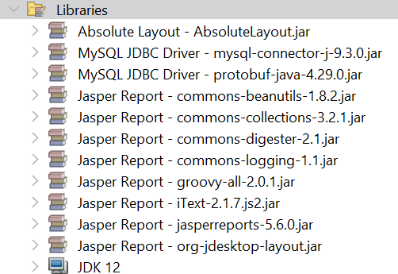
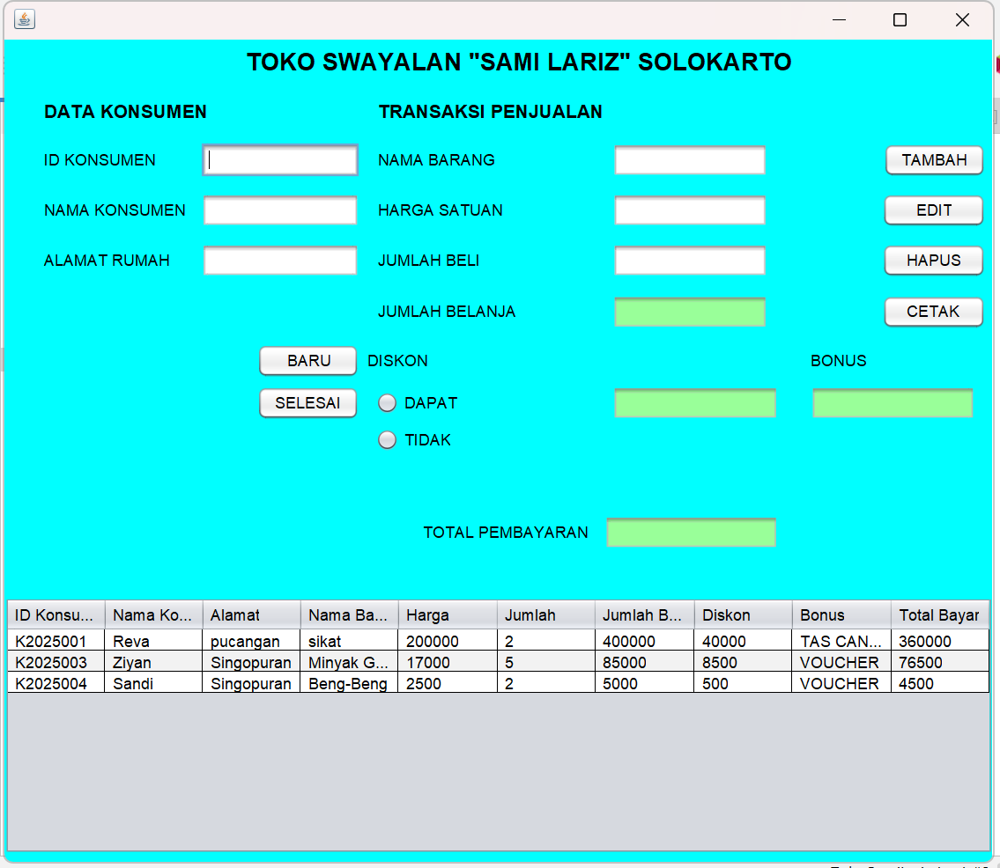
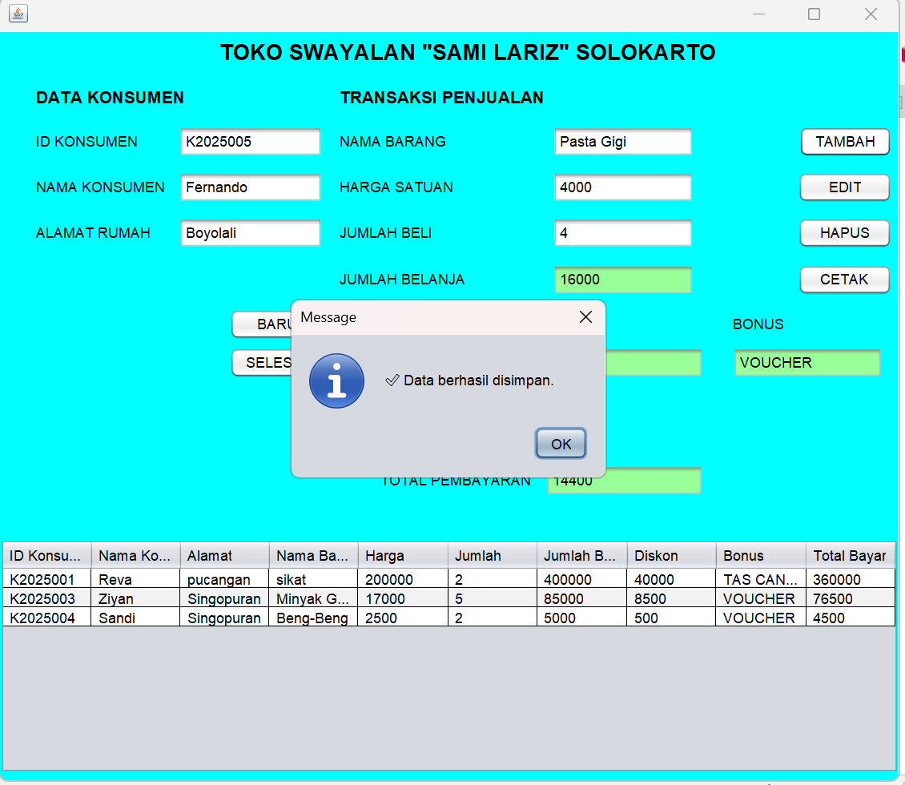
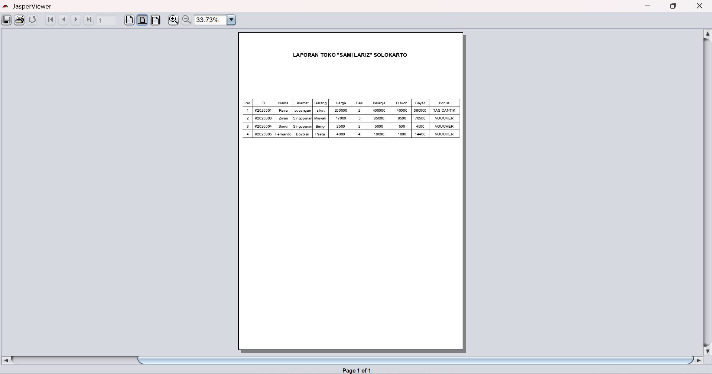

# 🎰Aplikasi Kasir Toko "SAMI LARIZ" SOLOKARTO

Aplikasi kasir berbasis desktop untuk Toko Swalayan "Sami Lariz" yang dikembangkan menggunakan Java Swing. Aplikasi ini menyediakan sistem manajemen transaksi penjualan dengan fitur perhitungan otomatis diskon, bonus, dan laporan yang dapat dicetak.

## 📃Penjelasan Singkat

Aplikasi ini adalah sistem Point of Sale (POS) sederhana yang memungkinkan pengelolaan data konsumen dan transaksi penjualan. Aplikasi menggunakan database MySQL untuk menyimpan data transaksi dan dilengkapi dengan fitur cetak laporan menggunakan JasperReports.

## ✅Fitur-Fitur Utama

- **Manajemen Data Konsumen**: Input dan pengelolaan data konsumen (ID, nama, alamat)
- **Input Transaksi**: Pencatatan data barang, harga, dan jumlah pembelian
- **Perhitungan Otomatis**: 
  - Jumlah belanja (harga × jumlah)
  - Diskon 10% (opsional berdasarkan pilihan)
  - Bonus berdasarkan total belanja (TAS CANTIK untuk ≥300.000, VOUCHER untuk <300.000)
  - Total pembayaran setelah diskon
- **CRUD Operations**: Tambah, edit, hapus, dan tampil data transaksi
- **Validasi Input**: Validasi untuk semua field wajib dan format data
- **Laporan**: Cetak laporan transaksi menggunakan JasperReports
- **Interface User-Friendly**: GUI yang mudah digunakan dengan tabel data

## ✏️Alur Kerja Sistem

1. **Input Data Konsumen**: User memasukkan ID konsumen, nama, dan alamat
2. **Input Data Barang**: User memasukkan nama barang, harga satuan, dan jumlah beli
3. **Perhitungan Otomatis**: Sistem menghitung jumlah belanja secara otomatis
4. **Pilihan Diskon**: User memilih apakah konsumen mendapat diskon atau tidak
5. **Kalkulasi Final**: Sistem menghitung diskon, menentukan bonus, dan total pembayaran
6. **Penyimpanan**: Data transaksi disimpan ke database MySQL
7. **Manajemen Data**: User dapat melihat, mengedit, atau menghapus data dari tabel
8. **Cetak Laporan**: User dapat mencetak laporan transaksi

## ⚙️System Requirements

- **Java Development Kit (JDK)**: Versi 12
- **Apache NetBeans IDE**: Versi 25 (atau IDE Java lainnya)
- **XAMPP**: Versi 8.2.12 (untuk server database MySQL)
- **MySQL Database**: Untuk penyimpanan data


### Database
- Tabel `swalayan` dengan struktur:
  ```sql
  CREATE TABLE swalayan (
      id_konsumen VARCHAR(50) PRIMARY KEY,
      nama_konsumen VARCHAR(100),
      alamat TEXT,
      nama_barang VARCHAR(100),
      harga INT,
      jumlah INT,
      jumlah_belanja INT,
      diskon INT,
      bonus VARCHAR(50),
      total_bayar INT
  );
  ```

## 📚Library-Library yang Digunakan



### Dependencies (JAR Files)
```
lib/
├── jasperreports-6.x.x.jar
├── mysql-connector-java-8.x.x.jar
├── commons-collections-x.x.jar
├── commons-logging-x.x.jar
└── itext-x.x.x.jar
```

## 🔩Instalasi/Cara Menjalankan

### 1. Persiapan Database
```bash
# Jalankan XAMPP
# Buka phpMyAdmin (http://localhost/phpmyadmin)
# Buat database baru dengan nama sesuai konfigurasi
# Import database 'toko_swalayan' dengan struktur
```

### 2. Konfigurasi Database
Pastikan file `Config.java` berisi konfigurasi database yang benar:
```java
public static Connection configDB() {
    // Sesuaikan dengan konfigurasi database Anda
    String url = "jdbc:mysql://localhost:3306/toko_swalayan";
    String username = "root";
    String password = "";
}
```

### 3. Setup Project
```bash
# Clone atau extract project
# Buka Apache NetBeans IDE 25
# File -> Open Project -> Pilih folder project
# Pastikan semua library sudah ditambahkan ke classpath
```

### 4. Menambahkan Libraries
```bash
# Klik kanan pada project -> Properties
# Libraries -> Add JAR/Folder
# Tambahkan semua JAR files yang diperlukan
```

### 5. Setup Report
```bash
# Pastikan file lapor_tokolariz.jasper ada di folder src/report/
# Atau compile file .jrxml menjadi .jasper jika diperlukan
```

### 6. Menjalankan Aplikasi
```bash
# Klik kanan pada FormTransaksi.java
# Run File (Shift+F6)
# Atau tekan F6 untuk menjalankan project
```

## 🖥️Contoh Output





### Contoh Kalkulasi Sistem
```
Input: 
- Harga Satuan: Rp 15.000
- Jumlah Beli: 20 pcs
- Diskon: DAPAT

Perhitungan:
- Jumlah Belanja = 15.000 × 20 = Rp 300.000
- Diskon = 300.000 × 10% = Rp 30.000
- Bonus = (300.000 >= 300.000) ? "TAS CANTIK" : "VOUCHER"
- Total Bayar = 300.000 - 30.000 = Rp 270.000
```

### Fitur Validasi
- ❗ Semua field wajib diisi
- ❗ Harga dan jumlah beli harus berupa angka positif
- ❗ Pilihan diskon harus dipilih
- ✅ Data berhasil disimpan
- ❌ Pesan error jika terjadi kesalahan

---

**Dibuat dengan ❤️ menggunakan Java & NetBeans IDE 25**

*Copyright © 2024 Toko Swalayan "Sami Lariz" Solokarto*